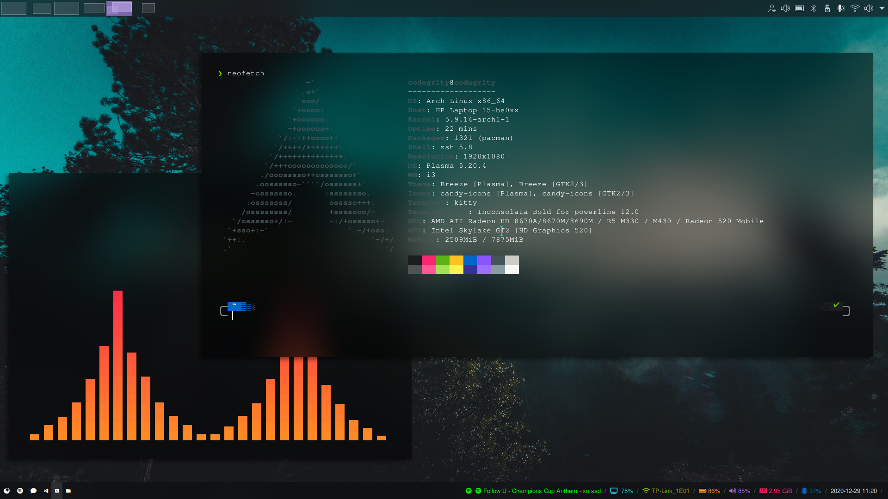
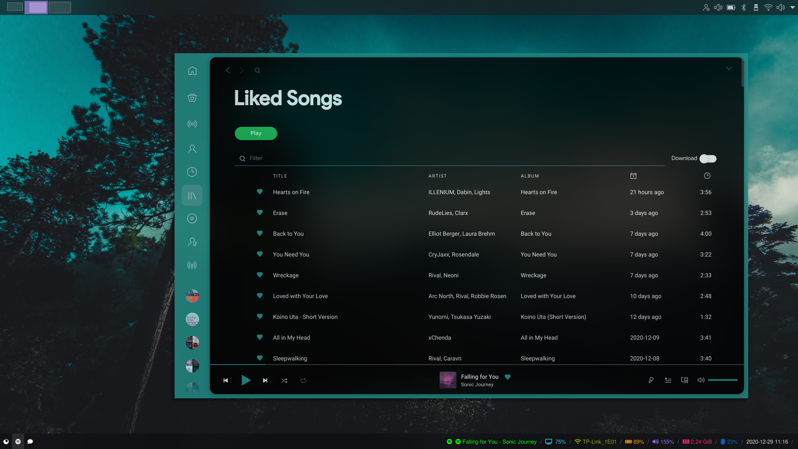

# 
A theme based on Elverlara's Sweet-Mars theme [https://store.kde.org/p/1393507/]

# Screenshots
## 
## 
## 
## 
## 

# Installation
The screenshots that you saw above were of i3+Plasma. You can install this theme on i3 without Plasma but then KDE applications wouldn't look as good.

## Requirements
Before we install the theme its necessary to setup the pre-requisite programs. I use `pamac` as a package manager for AUR but you can use anything such as `yay`. Assuming that you already have a basic i3 configuration already setup, execute the following lines of code-

```pamac install rofi polybar picom-ibhagwan-git ttf-font-awesome-pro nerd-fonts-jetbrains-mono kitty cava neofetch```

## Copying Configurations
Copy cava, i3, neofetch, picom and rofi folder from `.config/` in this repository to ~/.config and overwrite all the existing files and folders. (!BE SURE TO MAKE A BAKUP)
